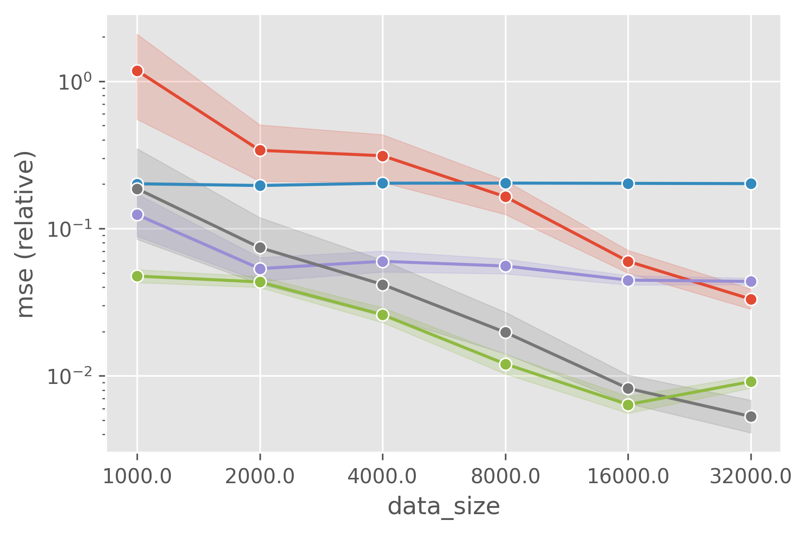
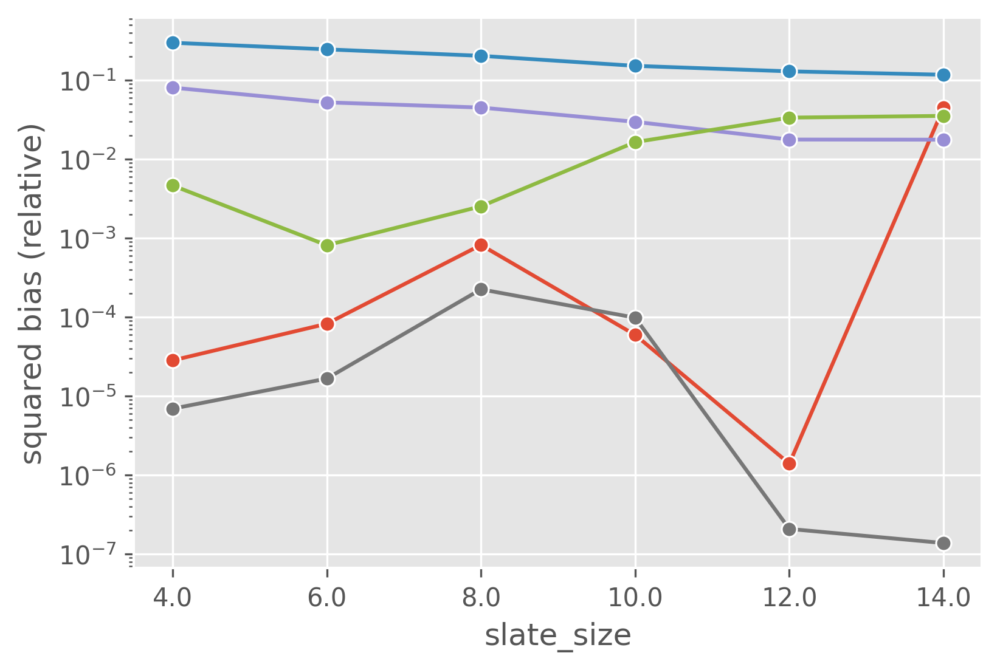
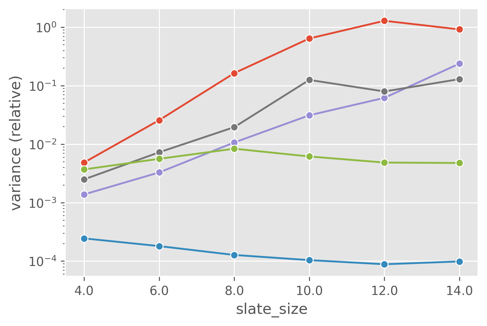
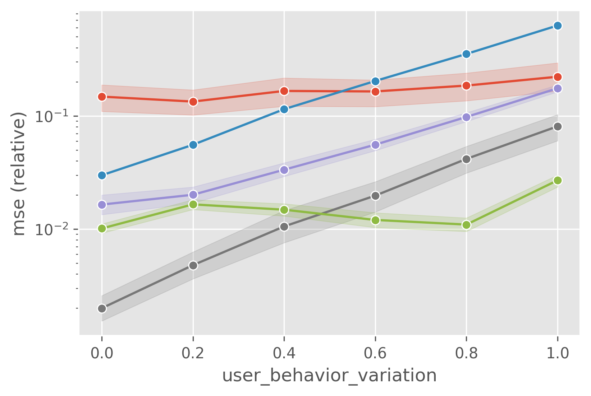
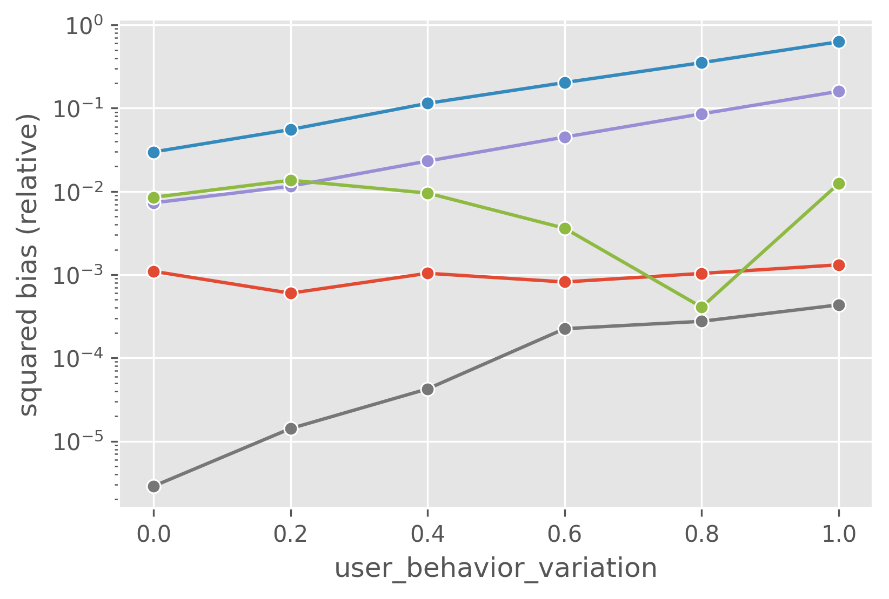
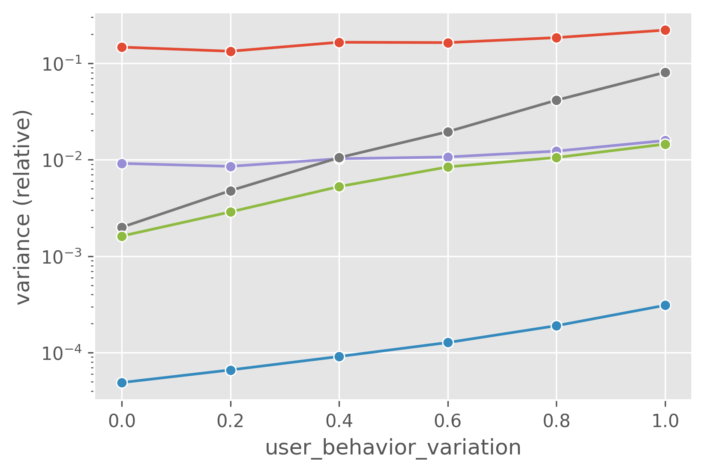

## Off-Policy Evaluation of Ranking Policies under Diverse User Behavior

---

### About

This repository contains the code to replicate the synthetic experiment conducted in the paper "[Off-Policy Evaluation of Ranking Policies under Diverse User Behavior]()" by [Haruka Kiyohara](https://sites.google.com/view/harukakiyohara), [Masatoshi Uehara](https://www.masatoshiuehara.com/), Yusuke Narita, Nobuyuki Shimizu, Yasuo Yamamoto, and [Yuta Saito](https://usait0.com/en/), which has been accepted to [KDD2023](https://kdd.org/kdd2023/). [[paper]()] [[arXiv]()] [[slides]()]

<details>
<summary><strong>Click here to show the abstract </strong></summary>

 

*Ranking* interfaces are everywhere in online platforms. There is thus an ever growing interest in their *Off-Policy Evaluation* (OPE), aiming towards an accurate performance evaluation of ranking policies using logged data. A de-facto approach for OPE is *Inverse Propensity Scoring* (IPS), which provides an unbiased and consistent value estimate. However, it becomes extremely inaccurate in the ranking setup due to its high variance under large action spaces. To deal with this problem, previous studies assume either independent or cascade user behavior, resulting in some ranking versions of IPS. While these estimators are somewhat effective in reducing the variance, all existing estimators apply a single universal assumption to every user, causing excessive bias and variance. Therefore, this work explores a far more general formulation where user behavior is diverse and can vary depending on the user context. We show that the resulting estimator, which we call *Adaptive IPS* (AIPS), can be unbiased under any complex user behavior. Moreover, AIPS achieves the minimum variance among all unbiased estimators based on IPS. We further develop a procedure to identify the appropriate user behavior model to minimize the MSE of AIPS in a data-driven fashion. Extensive experiments demonstrate that the empirical accuracy improvement can be significant, enabling effective OPE of ranking systems even under diverse user behavior.

</details>

### Dependencies
This repository supports Python 3.7 or newer.

- numpy==1.21.2
- pandas==1.4.3
- scikit-learn==1.0.2
- matplotlib==3.4.3
- seaborn==0.11.2
- obp==0.5.4
- hydra-core==1.0.6

### Running the code
To conduct the synthetic experiment, run the following commands.

```bash
python src/main.py setting={data_size/slate_size/user_behavior_variation} setting.{additional_config}={value} ...
```
Once the code is finished executing, you can find the result (`estimation_{setting}.csv`) in the `./logs/{setting}/` directory. (Lower value is better)
Please refer to `./conf` for the experimental configurations.

### Visualize the results
To visualize the results, run the following commands.

```bash
python src/visualize.py setting={data_size/slate_size/user_behavior_variation} setting.{additional_config}={value} ...
```

Then, you will find the three following figures (`{setting}_{mse/squared_bias/variance}.png`) in the `./figs/` directory. Lower value is better for the all the metrics.

| experiment parameter                     |  MSE                                                           |  squared bias                                                 |    variance                                   |
| :--------------------------------------: | :------------------------------------------------------------: | :-----------------------------------------:                   | :------------------------------------------------------------: |
| varying data size (n)                    |                            |                  |                       |
| varying length of ranking (K)            |                           |                 |                      |
| varying user behavior (δ)                |              |    |         |
